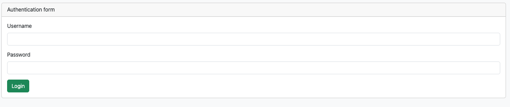
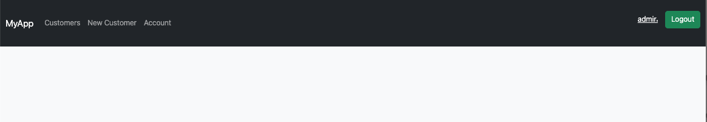
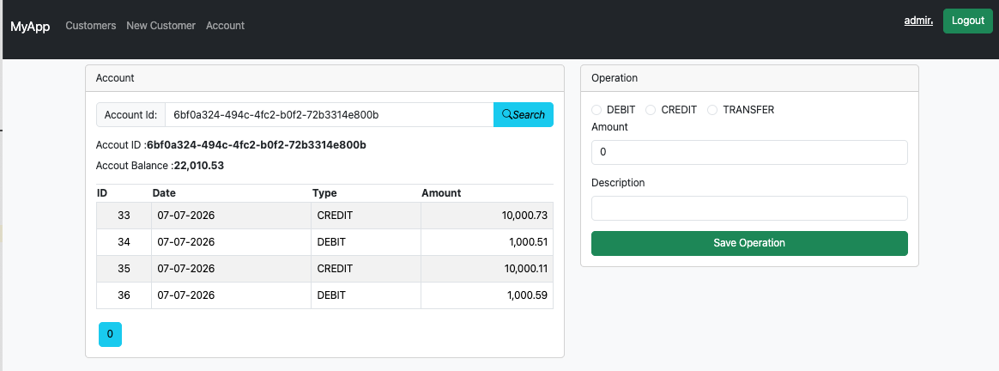
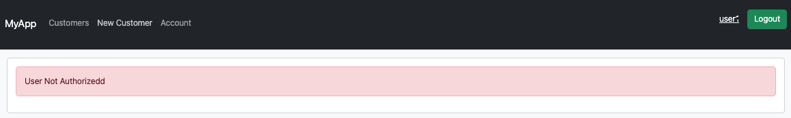
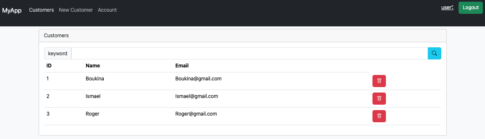

# Partie 2 :  Angular Client -   DigitalBanking Web

## simulation

### customer creation and validation

### delete customer

### data loading 

#### Authentication 

#### loging with ADMIN profile

#### loging with user profile

